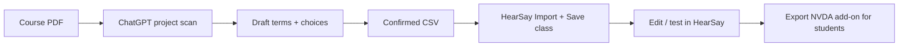

# What to upload to the ChatGPT project

Two kinds of files: **yours (project owner)** vs **the instructor’s (each course)**.

## A. Project files (you set up once)

Upload these under **Project → Files / Knowledge**. Every chat in the project can use them.

| File | Required? | Purpose |
|------|-----------|---------|
| **HearSay-Dictionary-Assistant-Guide.pdf** | Yes | Full rules, PDF-scan workflow, discipline examples, anti-hallucination, HearSay handoff |
| **hearsay-dictionary-template.csv** | Yes | Exact CSV columns HearSay expects |
| **example-output-snippet.csv** | Recommended | Token-only sample rows (no whole equations) |
| **SUBSCRIPT-RULES.md** | Recommended (chem labs) | Atomic token rules for calorimetry/subscripts |
| **INSTRUCTIONS-FOR-CHATGPT-PROJECT.txt** | No | Paste into **Instructions** field only — do not upload as knowledge |

Optional (not required):

| File | Purpose |
|------|---------|
| Instructor one-pager PDF | "Upload your syllabus PDF here, then answer pronunciation choices" — if you make a separate handout |

Do **not** upload as project knowledge:

- Entire institution dictionaries (huge, outdated, confuses the model)
- HearSay source code or `.dic` files (wrong format for this step)
- Student NVDA add-on `.nvda-addon` files (output of HearSay, not input to ChatGPT)

## B. Instructor files (each conversation / each course)

The instructor (or you testing) provides **per course**:

| Input | How |
|-------|-----|
| **Course PDF** | Attach in chat when starting: syllabus, lab manual, slide PDF, book chapter export |
| **Follow-up text** | Paste quiz stems, Canvas HTML/plain export, or term list if PDF OCR is poor |
| **Choices** | Reply A/B/C when the bot offers pronunciation options |

The course PDF does **not** need to live in project files unless it is the same document every term (e.g. static lab manual). Usually instructors attach their PDF **in the chat** each time.

## End-to-end path (what you described)

1. **ChatGPT** — scan PDF → collaborate → CSV  
2. **HearSay Dictionary** — import CSV, edit, connect Supabase, save class  
3. **HearSay** — Lab test → **MathSay** for Canvas equations → export **NVDA add-on** for students  
4. **Students** — install once; dictionary applies in Canvas/plain text

Nothing in HearSay needs to change for this workflow; the gap ChatGPT fills is **PDF → structured CSV** before import.

## If PDF scanning is weak

Tell instructors to:

- Re-export slides/Word as PDF with selectable text (not image-only scan)
- Paste 5–20 lines of quiz text into the same chat
- Use HearSay **Screen Reader Lab** after import; **MathSay** for Canvas equation HTML

## Character limit reminder

- **Instructions field:** paste `INSTRUCTIONS-FOR-CHATGPT-PROJECT.txt` only (~4k chars)  
- **Everything else:** in the PDF guide attached as project knowledge
